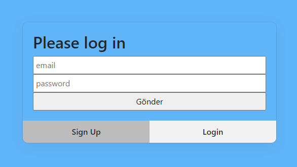
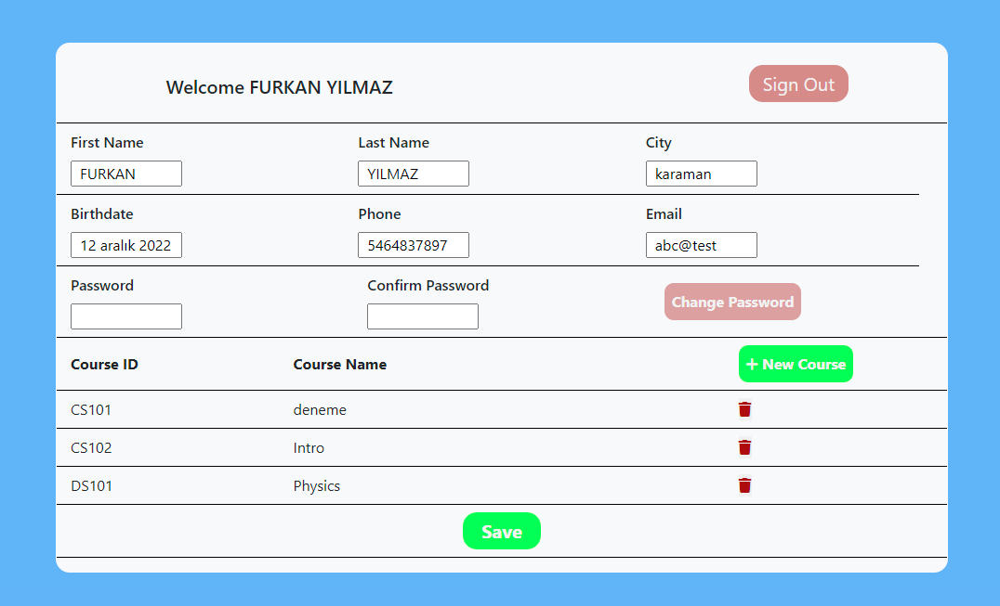
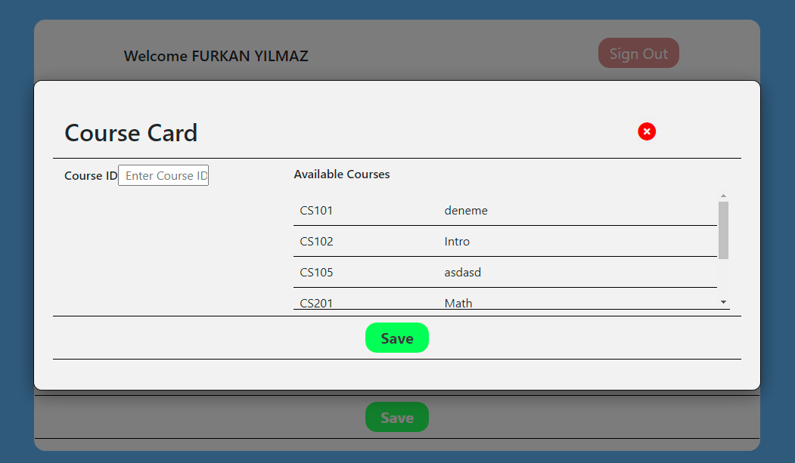
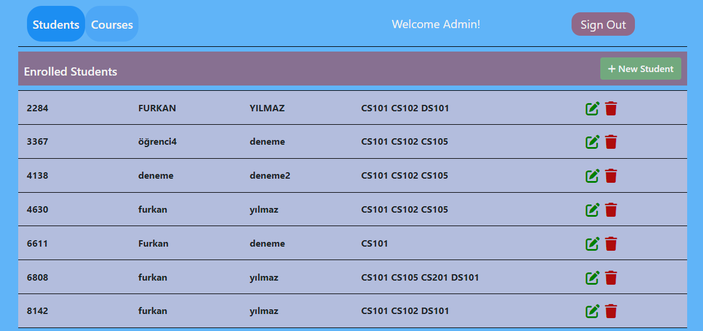
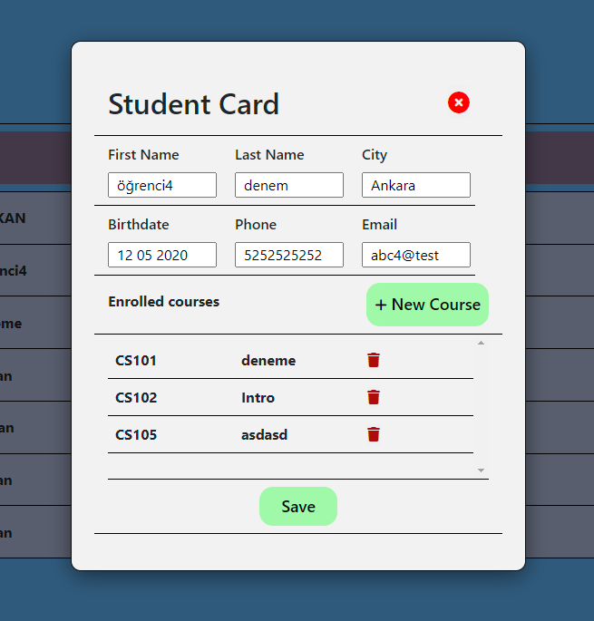
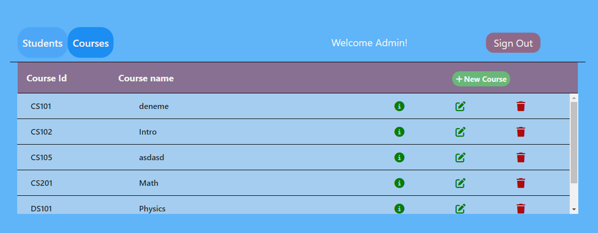

# Kusys-Demo Test Case solution

This is a solution to the Kusys-Demo Testing Case.

## Table of contents

- [Overview](#overview)
  - [The challenge](#the-challenge)
  - [Screenshot](#screenshot)
  - [Links](#links)
- [My process](#my-process)
  - [Built with](#built-with)
  - [What I learned](#what-i-learned)

## Overview

### The challenge

US-1. Create/Update/Delete a student,
US-2. List all Students and see details of a selected student in a popup.
US-3. Match a student with a selection of courses. (Constraint: a student can select a course once.)
US-4. List all Student & Course matchings
US-5. By adding a login mechanism and using 2 roles (Admin, User):
o Admins: can do US-1, US-2, US-3, US-4
o Users: can do US-2, US-3 (can match only herself/himself with the selected courses),
US-4 (can see only her/his matchings)

### Screenshot

## My process

In this project, users need to enter their credentials to access the system. If the user is a student and exists in the system, they will be redirected to their detail page where they can update their personal information, change their password, or view and manage their courses. If the student is not registered in the system, they can sign up and create an account.

After successfully registering, the student will be redirected to their detail page. If the user is an admin, they will be redirected to the admin page. In the admin page, the admin can view all the students who have registered in the system, and see their enrolled courses. The admin can create, update, or delete student accounts, enroll students in new courses, or remove them from enrolled courses. The admin can also list, add or delete all courses and see the students enrolled in each course.

The authorization mechanism is simple. If a user's email and password are verified in the system, their role (student or admin) will be returned to redirect them to their respective pages. Passwords will be stored in the database as hashed.

### Built with

- Semantic HTML5 markup
- CSS custom properties
- Flexbox
- CSS Grid
- Bootstrap UI
- React UI
- Node.js
- PostgreSql
- Express

### What I learned

I was a fully stranger to Nodejs and creating a server side. With this project my understanding on backend, endpoints, Express methods etc. drastically improved.

